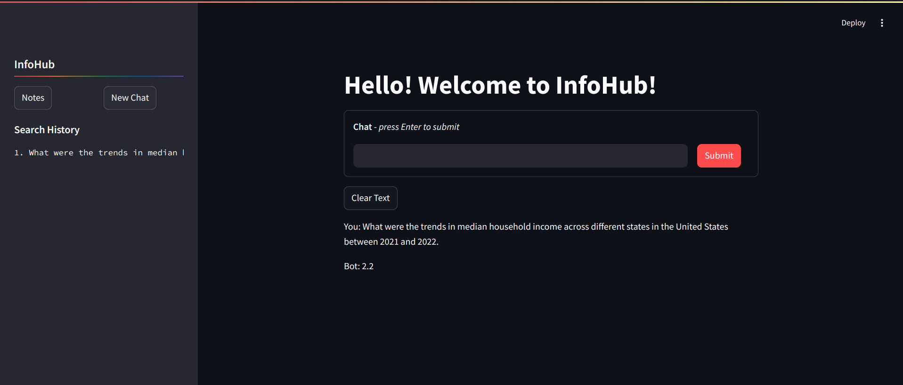

# PDF-based-QA-Chatbot
The PDF-based QA Chatbot is an interactive application designed to provide accurate and relevant answers to questions based on the content of a pre-uploaded PDF document, making it a powerful tool for extracting knowledge from large documents efficiently.
## Features
- Seamless integration with PDF documents.
- Advanced text embeddings using pre-trained models from HuggingFace.
- Easy-to-use web interface built with Streamlit for user-friendly interactions.
## Demo


## Table of Contents
- [Installation](#installation)
- [Usage](#usage)
- [Project Structure](#project-structure)
- [Development](#development)
- [Acknowledgments](#acknowledgments)

## Installation

### Prerequisites
- Python 3.8+

### Clone the Repository
```sh
git clone https://github.com/navyadhaka/pdf-based-qa-chatbot.git
cd pdf-based-qa-chatbot
```

### Create and Activate Virtual Environment
```sh
python -m venv venv
source venv/bin/activate  # On Windows, use `venv\Scripts\activate`
```

### Install Dependencies
```sh
pip install -r requirements.txt
```

### Usage
Run the Streamlit Application:
```sh
streamlit run Chatbot.py
```
Interact with the Chatbot:
Open your browser and navigate to the URL provided by Streamlit (usually http://localhost:8501). You can now interact with the chatbot by asking questions based on the content of the uploaded PDF documents.

### Project Structure
```bash
pdf-based-qa-chatbot/
│
├── us_census/              # Directory for storing downloaded PDFs
├── db/                     # Directory for storing embeddings database
├── QA_Chatbot.py           # Main chatbot logic
├── app.py                  # Streamlit application
├── requirements.txt        # Python dependencies
├── README.md               # Project documentation
```

### Development
Setting Up Development Environment
Fork the Repository:
Click the "Fork" button on the GitHub page to create a personal copy of the repository.

Clone Your Fork:
```sh
git clone https://github.com/yourusername/pdf-based-qa-chatbot.git
cd pdf-based-qa-chatbot
```
Create a New Branch:
```sh
git checkout -b feature-branch
```
Make Your Changes:
Implement your changes and commit them with a descriptive message.

Push to Your Fork:
```sh
git push origin feature-branch
```
Create a Pull Request:
Go to the original repository and open a pull request to merge your changes.

### Acknowledgments
- HuggingFace for providing powerful NLP models.
- Streamlit for making it easy to create interactive web applications.
